# Property-Value-Maximizer

Welcome to the Property-Value-Maximizer project! This initiative aims to apply **Machine Learning** and **regression algorithms** to accurately predict house prices in Ames, Iowa. Our client has inherited four properties and seeks to maximize their **market value** before selling. By analyzing key housing features and building a powerful predictive model, we strive to provide **data-driven insights** that lead to optimal pricing strategies.

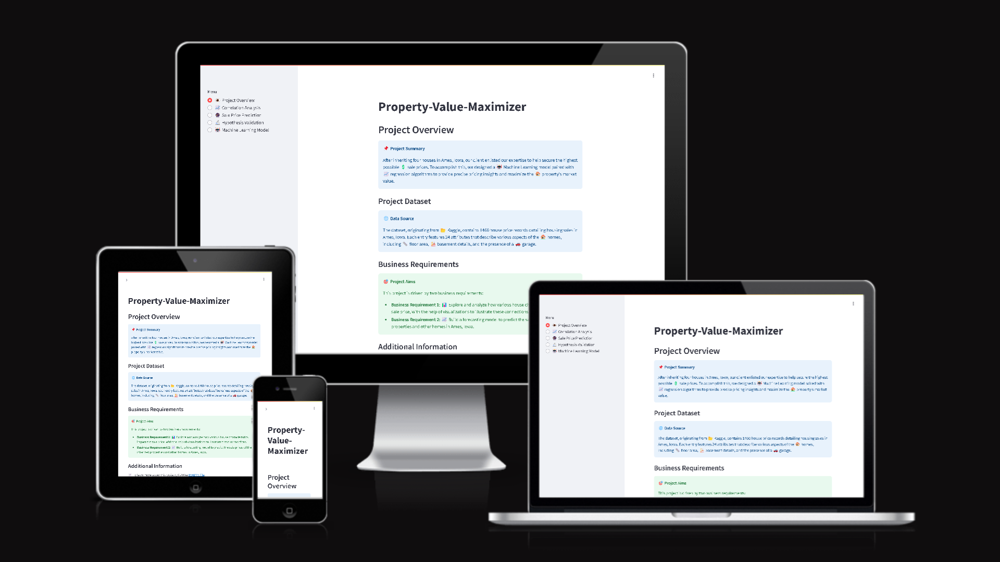

The project is accessible at the following URL: <https://property-value-maximizer.onrender.com>

# Table of Contents
- [Dataset Content](#dataset-content)
- [Business Requirements](#business-requirements)
- [Agile Methodology](#agile-methodology)
- [Hypothesis and how to validate hypothesis](#Hypothesis and how to validate hypothesis)
- [Rationale to map the business requirements to the Data Visualisations and ML tasks](#rationale-to-map-the-business-requirements-to-the-data-visualisations-and-ml-tasks)
- [Business Case Understanding](#business-case-understanding)
- [Cross-industry standard process for data mining](#cross-industry-standard-process-for-data-mining)
- [Data Preprocessing](#data-preprocessing)
  - [Data Cleaning Pipeline](#data-cleaning-pipeline)
  - [Feature Engineering](#feature-engineering)
    - [Categorical encoding](#categorical-encoding)
    - [Numerical Transformations](#numerical-transformations)
- [Dashboard Design](#dashboard-design)
  - [Streamlit sidebar](#streamlit-sidebar)
  - [Project Overview page](#project-overview-page)
  - [Correlation Analysis page](#correlation-analysis-page)
  - [Sale Price Prediction page](#sale-price-prediction-page)
  - [Hypothesis Validation page](#hypothesis-validation-page)
  - [Machine Learning model page](#machine-learning-model-page)
- [Plots](#plots)
  - [Distribution and Correlation Plots](#distribution-and-correlation-plots)
  - [Box Plots](#box-plots)
  - [Line Plots](#line-plots)
  - [Linear Model Plots](#linear-model-plots)
  - [Performance and Feature Importance](#performance-and-feature-importance)
- [Bugs and Fixes](#bugs-and-fixes)
- [Project Testing](#project-testing)
- [Deployment](#deployment)
- [Technologies](#technologies)
- [Python Packages](#python-packages)
- [Credits](#credits)
  - [Code](#code)
  - [Media](#media)
  - [Content](#content)
- [Acknowledgements](#acknowledgements)

## Dataset Content

* The dataset is sourced from [Kaggle](https://www.kaggle.com/codeinstitute/housing-prices-data). We then created a fictitious user story where predictive analytics can be applied in a real project in the workplace.
* The dataset has almost 1.5 thousand rows and represents housing records from Ames, Iowa, indicating house profile (Floor Area, Basement, Garage, Kitchen, Lot, Porch, Wood Deck, Year Built) and its respective sale price for houses built between 1872 and 2010.

|Variable|Meaning|Units|
|:----|:----|:----|
|1stFlrSF|First Floor square feet|334 - 4692|
|2ndFlrSF|Second-floor square feet|0 - 2065|
|BedroomAbvGr|Bedrooms above grade (does NOT include basement bedrooms)|0 - 8|
|BsmtExposure|Refers to walkout or garden level walls|Gd: Good Exposure; Av: Average Exposure; Mn: Minimum Exposure; No: No Exposure; None: No Basement|
|BsmtFinType1|Rating of basement finished area|GLQ: Good Living Quarters; ALQ: Average Living Quarters; BLQ: Below Average Living Quarters; Rec: Average Rec Room; LwQ: Low Quality; Unf: Unfinshed; None: No Basement|
|BsmtFinSF1|Type 1 finished square feet|0 - 5644|
|BsmtUnfSF|Unfinished square feet of basement area|0 - 2336|
|TotalBsmtSF|Total square feet of basement area|0 - 6110|
|GarageArea|Size of garage in square feet|0 - 1418|
|GarageFinish|Interior finish of the garage|Fin: Finished; RFn: Rough Finished; Unf: Unfinished; None: No Garage|
|GarageYrBlt|Year garage was built|1900 - 2010|
|GrLivArea|Above grade (ground) living area square feet|334 - 5642|
|KitchenQual|Kitchen quality|Ex: Excellent; Gd: Good; TA: Typical/Average; Fa: Fair; Po: Poor|
|LotArea| Lot size in square feet|1300 - 215245|
|LotFrontage| Linear feet of street connected to property|21 - 313|
|MasVnrArea|Masonry veneer area in square feet|0 - 1600|
|EnclosedPorch|Enclosed porch area in square feet|0 - 286|
|OpenPorchSF|Open porch area in square feet|0 - 547|
|OverallCond|Rates the overall condition of the house|10: Very Excellent; 9: Excellent; 8: Very Good; 7: Good; 6: Above Average; 5: Average; 4: Below Average; 3: Fair; 2: Poor; 1: Very Poor|
|OverallQual|Rates the overall material and finish of the house|10: Very Excellent; 9: Excellent; 8: Very Good; 7: Good; 6: Above Average; 5: Average; 4: Below Average; 3: Fair; 2: Poor; 1: Very Poor|
|WoodDeckSF|Wood deck area in square feet|0 - 736|
|YearBuilt|Original construction date|1872 - 2010|
|YearRemodAdd|Remodel date (same as construction date if no remodelling or additions)|1950 - 2010|
|SalePrice|Sale Price|34900 - 755000|

## Business Requirements

Our client has inherited four properties from her late great-grandfather, located in Ames, Iowa, USA. While she has a strong understanding of property prices in her home country, she is concerned that relying on her existing knowledge of the Iowan market may result in inaccurate appraisals. Factors that make a house desirable and valuable in her country may differ from those in Ames, Iowa.

The client has provided a public dataset containing house prices for the Ames area and has requested our assistance in maximizing the sale price for her inherited properties. Our goal is to predict the sale price of these four homes based on their respective attributes.

The business requirements are as follows:

- BR1 - The client wants to understand how various house attributes correlate with the sale price in Ames, Iowa. She expects data visualizations that illustrate the relationships between these variables and the sale price.

- BR2 - The client is looking to predict the sale price for her four inherited houses, as well as for any other property in Ames, Iowa.

To meet these business requirements, Epics and User Stories have been defined. These user stories have been further broken down into manageable tasks, allowing for an agile approach to implementation.

## Agile Methodology

### Epics
- **Data Collection and Information Gathering Epic**
- **Data Visualization, Cleaning, and Preparation Epic**
- **Model Training, Optimization, and Validation Epic**
- **Dashboard Planning, Design, and Development Epic**
- **Dashboard Deployment and Release Epic**

### User Stories
- **Data Collection and Information Gathering Epic**

  - User Story 1.1: Install Required Dependencies and Packages
    - As a developer, I need to install all required dependencies and packages so that I can effectively utilize the necessary tools for project implementation.
      - Acceptance Criteria:
        - All dependencies are installed successfully without errors.
      - Tasks:
        - Install all required dependencies using the PIP package manager.
      - How they were completed:
        - The command `pip install -r requirements` was typed in the IDE terminal.

  - User Story 1.2: Import Relevant Data into Jupyter Notebook
    - As a developer, I need to import relevant data into a Jupyter Notebook so that I can conduct a thorough analysis of the dataset.
      - Acceptance Criteria:
        - The housing dataset is successfully downloaded from Kaggle.
        - The dataset is in CSV format and correctly read using Pandas.
      - Tasks:
        - Download the housing dataset from Kaggle using the Kaggle API.
        - Read the CSV files into DataFrames using Pandas.
      - How they were completed:
        - The kaggle.json credentials file was downloaded from kaggle.com and used to authenticate with the API to download the housing dataset.
        - The `pd.read_csv()` function was used to read the CSV files into a DataFrame.

- **Data Visualization, Cleaning, and Preparation Epic**

  - User Story 2.1: Data Cleaning and Quality Assurance
    - As a developer, I want to implement a robust data cleaning process so that I can ensure the dataset is accurate, reliable, and of high quality.
      - Acceptance Criteria:
        - All missing or null values in the dataset must be identified.
        - A data profile report must be generated.
        - Visualizations should demonstrate the effect of cleaning.
        - Missing values are imputed.
      - Tasks:   
        - Inspect the dataset to identify missing or null values.
        - A complete data profile report is generated.
        - Create visualizations (bar charts, box plots, histograms).
        - Apply imputation to missing values.
      - How they were completed:
        - The expression `df.isnull()` or `df.isna()` returns missing values.
        - the expression `ProfileReport(df=df, minimal=True)` generates an automated exploratory data analysis (EDA) report.
        - A custom function called `DataCleaningEffect()` visualizes the effects of cleaning.
        - 
- **Model Training, Optimization, and Validation Epic**

  - User Story 3.1: Model Performance Evaluation
    - As a developer, I want to evaluate the performance of the predictive model so that I can ensure the reliability and accuracy of its predictions.
      - Acceptance Criteria:
        - The predictive model must be evaluated to ensure reliability and accuracy of its predictions.
      - Tasks:
        - Evaluate the predictive model to ensure reliability and accuracy of its predictions.
      - How they were completed:
        - An R2 score of at least 0.75 on the train set and test set was measured.

  - User Story 3.2: Individual Prediction Testing
    - As a developer, I want to test individual data points against the model’s predictions so that I can determine the target variable based on my provided features.
      - Acceptance Criteria:
        - 
      - Tasks:
        - 
      - How they were completed:
        - 
- **Dashboard Planning, Design, and Development Epic**

  - User Story 4.1: Streamlit Landing Page Access
    - As a client, I want to access the Streamlit landing page so that I can quickly gain an overview of the project.
      - Acceptance Criteria:
        - The client should be able to quickly gain an overview of the project through the Streamlit landing page.
      - Tasks:
        - Create a streamlit landing page that allows the client to quickly gain an overview of the project.
      - How they were completed:
        -  A Streamlit multi-page application with a sidebar was created to allow the client to quickly gain an overview of the project. 
  - User Story 4.2: Data Visualization for Insights
    - As a client, I want to view data visualizations that illustrate the relationship between the target variable and its key features so that I can gain deeper insights from the data.
      - Acceptance Criteria:
        - The client should be able to view data visualizations that illustrate the relationship between the target variable.
      - Tasks:
        - Create a streamlit page that shows data visualizations that illustrate the relationship between the target variable.
      - How they were completed:
        - A correlation analysis streamlit page was created that shows data visualizations that illustrate the relationship between the target variable.
  
  - User Story 4.3: Correlation Analysis View
    - As a client, I want to view a correlation analysis page on Streamlit so that I can understand the relationships between various features and the target variable.
      - Acceptance Criteria:
        - The correlation analysis page has to be accessible through the Streamlit sidebar.
        - The page should display visual representation between features and the target variable.
        - The page should allow the client to interact with the heatmap.
      - Tasks:
        - Create a correlation analysis page that is accessible through the Streamlit sidebar.
        - Create a heatmap or visual representation of the correlations between features and the target variable.
        - Create a page that allows the client to interact with the heatmaps.
      - How they were completed:
        - The correlation analysis page was created and made accesible through the Streamlit sidebar by adding its body function `correlation_analysis_body()` to `app.py`
        - The visual representations were created with `px.histogram` for histograms, `px.imshow` for heatmaps, and `px.scatter` for scatter plots.
        - The heatmaps were plotted on the page with Plotly which has built-in interactivity.
  - User Story 4.4: Key Features for Sale Price Prediction
    - As a client, I want to identify the key attributes of a house that have the strongest correlation with its potential sale price so that I can make data-driven pricing decisions.
      - Acceptance Criteria: 
        - The client should be able to identify the key attributes of a house that have the strongest correlation with its potential sale price.
      - Tasks:
        - Perform pearson and spearman correlation analysis to find the relationship between different features and the sale price.
      - How they were completed:
        - The code `df.corr(method="pearson")` was used to calculate pearson correlation, and `df.corr(method="spearman")` to calculate spearman correlation on the DataFrame.
  
  - User Story 4.5: Interactive Prediction Input
    - As a client, I want interactive input fields that allow me to enter custom data so that I can generate personalized predictions for the target variable.
      - Acceptance Criteria:
        - The input fields should allow the user to enter values for each feature or variable that influences the prediction.
        - Each input field must have validation to ensure the entered data is in the correct format.
      - Tasks:
        - Create input fields that allow the user to enter values for each feature or variable that influences the prediction.
        - Create input fields with validation to ensure the entered data is in the correct format.
      - How they were completed:
        - Streamlit widgets were created with `st.number_input` to allow the user to enter values for each feature or variable that influences the prediction.
        - Input widgets were given a defined `min_value` and `max_value` to ensure the input is within a realistic range.
  
  - User Story 4.6: Accurate Sale Price Prediction
    - As a client, I want the most accurate possible prediction of the sale prices for the inherited properties so that I can maximize the financial returns from selling the four houses.
      - Acceptance Criteria:
        - The sale prices of the inherited properties must be accurately predicted.
      - Tasks:
        - Predict the price accurately of the inherited properties.
      - How they were completed:
        - A machine learning regression model was used to accurately predict the price of the inherited properties.

  - User Story 4.7: Predictive Model Dashboard
    - As a developer, I need to create a dashboard to effectively visualize and communicate the results of the model's predictions.
      - Acceptance Criteria:
        - A streamlit dashboard must be created.
        - The dashboard must visualize and communicate the results of the model's predictions.
      - Tasks:
        - Create a streamlit dashboard.
        - Create a dashboard that visualizes and communicates the results of the model's predictions.
      - How they were completed:
        - The Python streamlit library was used to create a dashboard.
        - A dashboard was created that displays the model's predictions through DataFrames and a Sales Price calculator.

- **Dashboard Deployment and Release Epic**

  - User Story 5.1: Early Deployment on Render
    - As a developer, I want to initiate the deployment process of my application on Render at an early stage so that I can conduct end-to-end manual deployment testing from the outset.
      - Acceptance Criteria:
        - The application must be successfully deployed to Render.
        - Build and start commands must be correctly configured.
        - The environment variables must be configured correctly for deployment.
        - Deployment is automated with auto-deploy.   
      - Tasks:
        - Deploy the application to Render
        - Define the necessary build and start commands in Render settings
        - Configure environment variables required for deployment.
        - Enable auto-deploy from the connected repository. 
      - How they were completed:
        - A new Web Service was created on Render
        - The build command was set to `pip install -r requirements.txt && ./setup.sh` and the start command to `streamlit run app.py`
        - Environment variables were set to `PORT` `Value: 8501` and `PYTHON_VERSION` `Value: 3.12.1`
        - Auto-deploy settings were set to Yes.

## Hypothesis and how to validate hypothesis

- First Hypothesis: The Relationship Between Property Size and Sale Price
  - Our first hypothesis posits that the size of a property has a direct and positive influence on its sale price. This assumption is grounded in the widely accepted notion that larger properties tend to offer more space and functionality, which in turn, makes them more attractive to potential buyers. The increased square footage of a property typically allows for additional rooms, larger living areas, and greater customization options, all of which are desirable attributes in a real estate market. Consequently, it is expected that properties with greater size will command higher sale prices due to their enhanced utility and appeal.
    - How to validate hypothesis: We will examine the relationship between house size attributes and sale price to test this hypothesis.
    - Hypothesis Confirmation: Following a rigorous correlation analysis of the dataset, we observed a positive and moderate correlation between the size-related features of the properties and their sale prices. This finding validates our hypothesis, as it indicates that larger properties indeed tend to sell for higher prices. The data clearly supports the notion that, all other factors being equal, the size of a property plays a significant role in determining its market value, confirming our initial assumption.

- Second Hypothesis: The Impact of Overall Quality on Sale Price
  - Our second hypothesis focuses on the role of a property's overall quality in influencing its sale price. We hypothesize that properties with higher quality ratings, which reflect superior materials, craftsmanship, and design, will be priced higher in the market. Buyers are likely to place a premium on well-constructed homes that offer longevity, comfort, and aesthetic appeal, which in turn boosts their market value. As such, homes with higher quality ratings should be more desirable and consequently demand higher prices.
    - How to validate hypothesis: We will examine the correlations between various attributes related to house quality assessment, such as 'OverallQual' and 'KitchenQual,' in order to validate the hypothesis.
    - Hypothesis Confirmation: After analyzing the data, we confirmed that there is a strong correlation between a property's overall quality rating and its sale price. Homes that received higher quality ratings were consistently priced higher in the market, reinforcing the idea that construction quality plays a pivotal role in determining a property’s value. This analysis supports our hypothesis that factors such as the quality of materials, craftsmanship, and overall design are crucial in shaping buyer perceptions and influencing the final sale price.

- Third Hypothesis: The Influence of Property Condition on Market Value
  - For our third hypothesis, we investigate how a property's condition affects its sale price. We hypothesize that homes in excellent condition, particularly those that have undergone recent renovations or are newly built, will be more desirable to buyers and therefore will command higher sale prices. The condition of a property often reflects its upkeep and can signal to buyers the level of maintenance and care invested in the home. Properties in better condition are generally perceived as more move-in ready, which makes them more attractive to prospective buyers looking for immediate comfort without the need for costly repairs or improvements.
    - How to validate hypothesis: We will explore the data related to 'YearBuilt' and 'YearRemodAdd' to validate this hypothesis.
    - Hypothesis Confirmation: Our analysis supports this hypothesis by revealing a positive and moderate correlation between sale price and key factors such as the property's construction year and the year of its last remodel. The data suggests that newer homes and those with recent upgrades tend to sell at higher prices, highlighting the importance of property condition in the pricing process. The findings confirm that well-maintained homes or those with modern features are more likely to achieve higher sale prices, underscoring the influence of condition on market value.

## Rationale to map the business requirements to the Data Visualisations and ML tasks

- **Business Requirement 1: Data Visualization & Correlation Analysis**
  - Conduct a correlation study using Pearson and Spearman correlation coefficients to assess the relationship between house attributes and the target variable, house price.
  - Evaluate the significance of these correlations.
  - Visualize key variables against house prices to gain insights into their impact.
  - This analysis is documented in the following notebook: <https://github.com/linobollansee/property-value-maximizer/blob/main/jupyter_notebooks/03%20-%20CorrelationStudy.ipynb>

- **Business Requirement 2: Regression Analysis for Price Prediction**
  - Since house price is a continuous variable, a regression analysis is performed to build a predictive model.
  - If regression models do not meet performance expectations, classification-based approaches may be explored.
  - The goal is to predict house prices using key features: `OverallQual`, `GrLivArea`, `GarageArea`, `YearBuilt`, `TotalBsmtSF`
  - This analysis is detailed in the following notebook: <https://github.com/linobollansee/property-value-maximizer/blob/main/jupyter_notebooks/05%20-%20MLModelEvaluation.ipynb>
  
## Business Case Understanding

- **Objective**  
We want an ML model to predict the sale prices of houses based on their various attributes, using publicly available data, specifically in Ames, Iowa.

- **Ideal Outcome**  
Our ideal outcome is to deliver an interactive dashboard that not only allows the client to visualize the correlation between house features and sale prices but also predicts the sale price for each house, including the inherited ones.

- **Success Metrics**  
The model success metrics are:
  - Achieving an **R² score** of at least 0.75 on both the training and test datasets, indicating that the model can reliably predict sale prices.
  - Providing actionable insights through **clear visualizations** of the features most strongly correlated with the sale price.

- **Model Output**  
The model output is the **predicted sale price** of a house, expressed in USD as a continuous numeric value.

- **Heuristics**  
  - **Property Size**: We hypothesize that larger properties tend to command higher absolute sale prices. Features like **1stFlrSF**, **GrLivArea**, **LotArea**, and **TotalBsmtSF** are expected to have a positive correlation with sale price, as larger homes typically offer more utility and are more attractive to buyers.
  - **Overall Quality**: The overall quality of the house plays a significant role in its market value. Higher quality ratings such as **OverallQual** are expected to have a strong positive correlation with sale prices, as higher quality homes are more desirable due to better materials and craftsmanship.
  - **Property Condition**: The condition of a house, including factors such as age and renovations, is expected to influence the sale price. We hypothesize that newer homes or those with recent updates, indicated by features like **YearBuilt** and **YearRemodAdd**, will have a higher market value. A good condition rating (**OverallCond**) should also correlate positively with higher sale prices.

- **Training Data**  
  The training data will be:
  - **Publicly available** dataset containing various house attributes and their corresponding sale prices in Ames, Iowa.
  - The dataset will include variables such as:
    - **1stFlrSF**: First floor square feet
    - **2ndFlrSF**: Second-floor square feet
    - **BedroomAbvGr**: Bedrooms above grade (does NOT include basement bedrooms)
    - **BsmtExposure**: Refers to walkout or garden level walls
    - **BsmtFinType1**: Rating of basement finished area
    - **BsmtFinSF1**: Type 1 finished square feet
    - **BsmtUnfSF**: Unfinished square feet of basement area
    - **TotalBsmtSF**: Total square feet of basement area
    - **GarageArea**: Size of garage in square feet
    - **GarageFinish**: Interior finish of the garage
    - **GarageYrBlt**: Year garage was built
    - **GrLivArea**: Above grade (ground) living area square feet
    - **KitchenQual**: Kitchen quality
    - **LotArea**: Lot size in square feet
    - **LotFrontage**: Linear feet of street connected to property
    - **MasVnrArea**: Masonry veneer area in square feet
    - **EnclosedPorch**: Enclosed porch area in square feet
    - **OpenPorchSF**: Open porch area in square feet
    - **OverallCond**: Rates the overall condition of the house
    - **OverallQual**: Rates the overall material and finish of the house
    - **WoodDeckSF**: Wood deck area in square feet
    - **YearBuilt**: Original construction date
    - **YearRemodAdd**: Remodel date (same as construction date if no remodeling or additions)
    - **SalePrice**: Sale Price

- **Benefits for the Client**  
  This ML model will allow the client to confidently estimate the sale price of any house in Ames, especially their inherited properties, and make informed decisions to maximize their sale value.

## Cross-industry standard process for data mining

This project applies the CRISP-DM (CRoss Industry Standard Process for Data Mining) methodology.

|Phase|Explanation|
|---|---|
|**Business Understanding**|This phase focuses on understanding the project objectives and requirements from a business perspective. The goal is to define the problem, set objectives, and determine the data mining goals to achieve business success.|
|**Data Understanding**|In this phase, the focus is on collecting initial data and understanding its quality, content, and structure. It involves exploratory data analysis to uncover insights, patterns, and potential issues.|
|**Data Preparation**|This phase involves cleaning and transforming raw data into a suitable format for modeling. It includes tasks like dealing with missing data, outlier detection, and feature engineering.|
|**Modeling**|In this phase, various data mining techniques (such as classification, regression, clustering, etc.) are applied to the prepared data to create models. It is often an iterative process where models are trained, tested, and refined.|
|**Evaluation**|After the model has been built, this phase evaluates its performance based on predefined criteria. The model is assessed to ensure it meets business goals and objectives before it is deployed.|
|**Deployment**|The final phase focuses on implementing the data mining solution into the business environment. This includes integrating the model into production systems, delivering results, and monitoring its impact on business processes.|

## Data Preprocessing

### Data Cleaning Pipeline

A data cleaning pipeline was developed to handle missing values. Various imputation methods were applied based on the statistical properties of the variables.

- Mean Imputation for Normally Distributed Continuous Variables
  - For continuous features such as `LotFrontage` and `BedroomAbvGr`, missing values were imputed using the mean. This approach is suitable for variables that follow an approximately normal distribution without significant outliers, as it maintains the overall data distribution without skewing the central tendency.

- Median Imputation for Skewed Continuous Variables
  - Variables exhibiting right-skewed distributions, such as `2ndFlrSF` and `MasVnrArea`, were imputed using the median. Since the median is less sensitive to extreme values, it provides a more robust imputation strategy for skewed data, preventing artificial distortion of the dataset.

- Categorical Variable Imputation with 'None'
  - Categorical features like `GarageFinish`, `BsmtFinType1`, and `BsmtExposure` were missing primarily because these attributes did not apply to certain properties (e.g., a house without a basement). To preserve this structural information, missing values were imputed with "None" rather than the mode, ensuring that the absence of a feature is explicitly represented rather than inferred as a common category.

- Feature Removal Due to High Missingness
  - Features such as `EnclosedPorch`, `GarageYrBlt`, and `WoodDeckSF` contained a substantial proportion of missing values. Rather than imputing them with limited available observations which could introduce bias, these features were removed from the dataset. Their exclusion was justified based on their potential lack of predictive power and the risk of introducing noise into the model.

For imputation rationale, refer to the detailed analysis in the following notebook: <https://github.com/linobollansee/property-value-maximizer/blob/main/jupyter_notebooks/02%20-%20DataCleaning.ipynb>

### Feature Engineering

#### Categorical encoding
Categorical encoding was applied to convert ordinal categories into numerical values, preserving both the order and hierarchy of the categories. This allowed the regression analysis to account for their relative rankings. However, during the data cleaning process, most ordinal categories were removed.  

#### Numerical Transformations

|**Feature**|**Assessment**|**Applied Transformation**|
|----|----|----|
|TotalBsmtSF| Mean imputation proved to be the most effective method for handling missing values.|MeanMedianImputer|
|GrLivArea| A logarithmic transformation was the best approach to achieve normalization.|LogTransformer|
|TotalBsmtSF| Power transformation yielded the most effective normalization.|PowerTransformer|
|TotalBsmtSF, GarageArea| Outliers were best handled using Winsorization with the IQR method.|Winsorizer|
|TotalBsmtSF, GrLivArea, GarageArea|Standard scaling provided the most effective way to normalize feature ranges.|StandardScaler|

## Dashboard Design

### Streamlit sidebar

- Streamlit sidebar: A Streamlit sidebar is a UI component in Streamlit that allows you to place widgets, controls, and other elements in a collapsible side panel. It helps organize interactive elements separately from the main content, improving usability and layout. This sidebar supports:
  - Navigation – Allow users to switch between different pages or sections of an app. Pages available:  
    - 👁️ Project Overview
    - 📈 Correlation Analysis
    - 🔮 Sale Price Prediction
    - 🔬 Hypothesis Validation
    - 🤖 Machine Learning Model
  - Business requirements covered: 
    - BR1 - The client wants to understand how various house attributes correlate with the sale price in Ames, Iowa. She expects data visualizations that illustrate the relationships between these variables and the sale price.
    - BR2 - The client is looking to predict the sale price for her four inherited houses, as well as for any other property in Ames, Iowa.


### Project Overview page

- Project Overview page
  - Project Overview: Describes the objective of maximizing property sale prices using a machine learning model.
  - Project Dataset: Provides details about the data source, size, and attributes used for analysis.
  - Business Requirements: Outlines the goals of analyzing house characteristics and developing a predictive pricing model.
  - Additional Information: Refers to further details available in a README file.

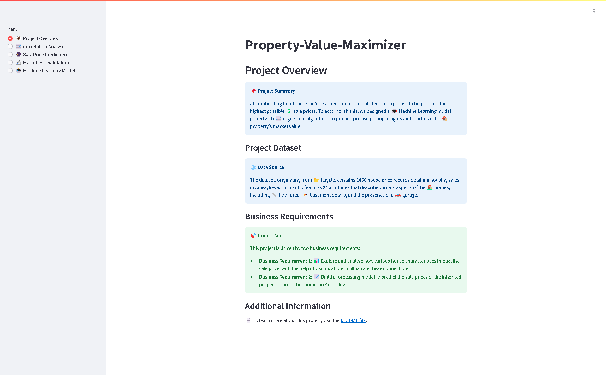

### Correlation Analysis page

- Correlation Analysis page
  - Correlation Analysis: Focuses on examining the relationship between different house features and sale prices. The goal is to use data visualizations to highlight how these features impact pricing.
  - Inspect house data from the dataset checkbox: If this box is checked, it loads the dataset as a DataFrame table. It can be downloaded as a CSV file, searched, or set to full screen.
  - The analysis investigated factors affecting house sale prices, aiming to identify key variables influencing pricing trends. The correlation analysis highlighted the following variables most closely linked to sale prices: '1stFlrSF', 'GarageArea', 'GarageYrBlt', 'GrLivArea', 'KitchenQual_Ex', 'KitchenQual_TA', 'OverallQual', 'TotalBsmtSF', 'YearBuilt', and 'YearRemodAdd'.
  - The analysis identified key factors affecting home values: larger homes with more features are more valuable, better condition and higher-quality materials increase value, and newly built or recently renovated homes tend to have higher market prices.
  - Data Visualizations: Interactive plotly plots that can be downloaded as PNG, zoomed, panned, autoscaled, have its axes reset, and be viewed in fullscreen.
    - Distribution of target variable checkbox: If this box is checked, it loads an interactive plotly histogram of the SalePrice.
    - Show Correlations and PPS Heatmaps: If this box is checked, it loads three  interactive plotly heatmaps, two featuring spearman and pearson correlation heatmaps, and one featuring a predictive power score heatmap.
    - Variables Plots - Visual Analysis: If this box is checked, it loads eight interactive plotly scatter plots, 1stFlrSF, GarageArea, GarageYrBlt, GrLivArea, OverallQual, TotalBsmtSF, YearBuilt, YearRemodAdd, all individually versus the SalePrice.


### Sale Price Prediction page

- Sale Price Prediction page
  - 
  -
  -


### Hypothesis Validation page

- Hypothesis Validation page
  -
  -
  -

- Hypothesis Validation page
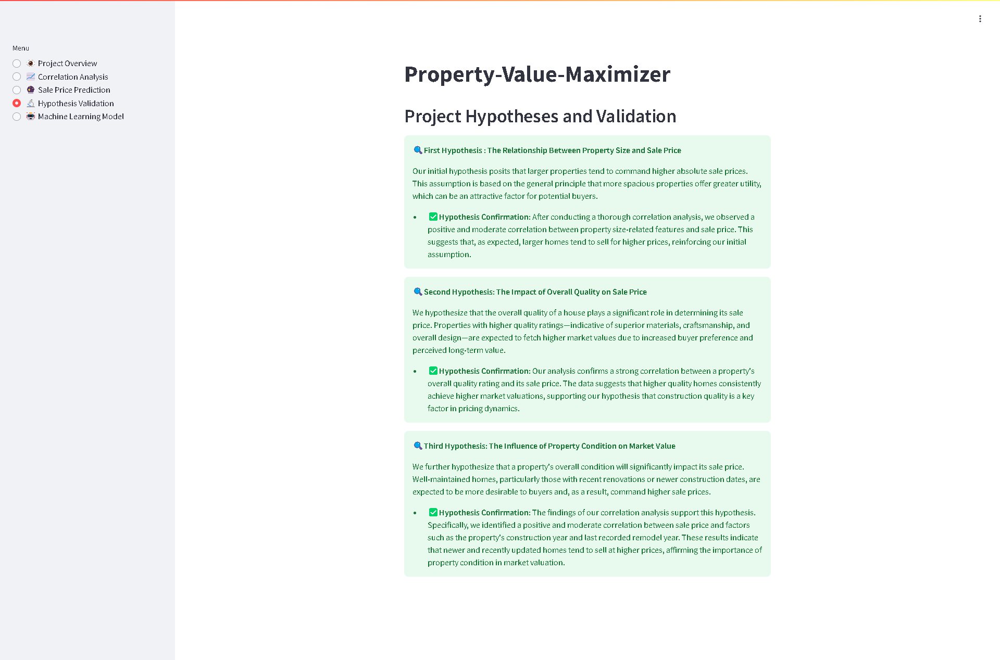

### Machine Learning Model page

- Machine Learning Model page
  -
  -
  -

- Machine Learning Model page
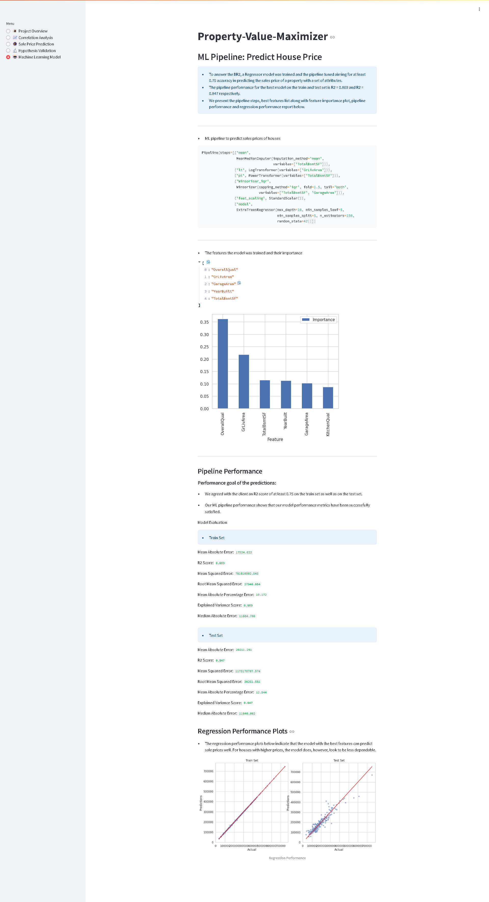

## Plots

### Distribution and Correlation Plots
These plots give insight into the distribution and relationships within the data.

*Histogram of Sale Price to visualize its distribution.*
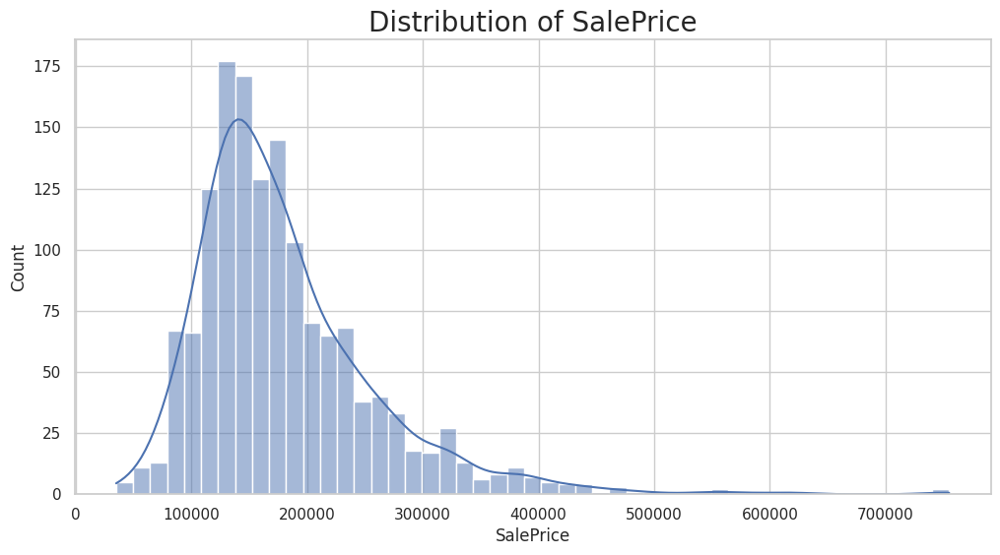

*Heatmap showing Pearson correlation between variables.*
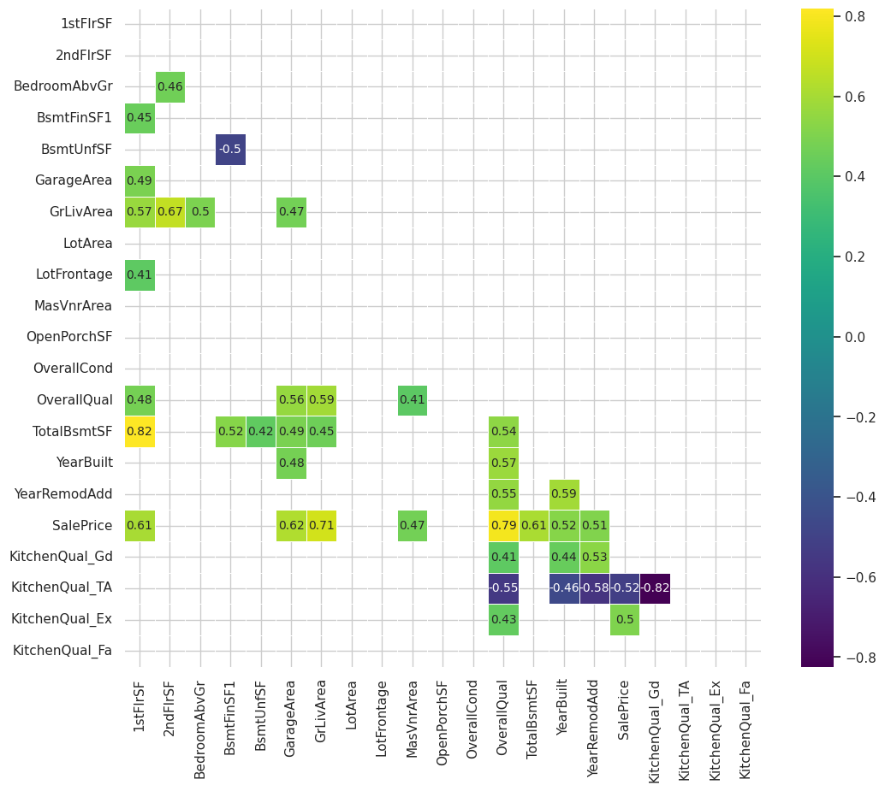

*Heatmap showing Spearman correlation between variables.*
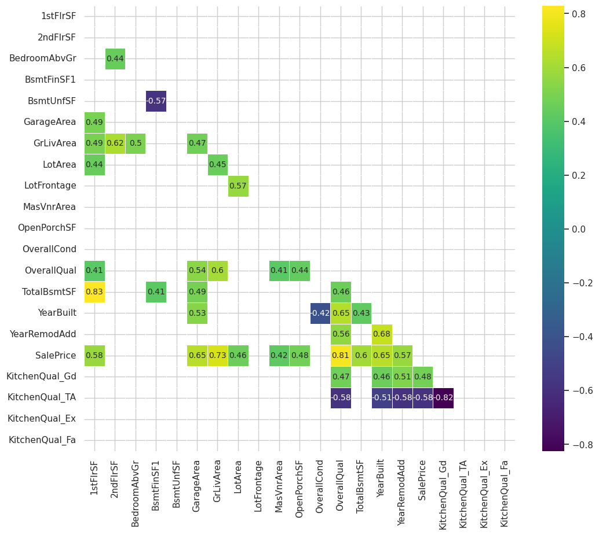

*Heatmap illustrating Partial Pairwise Correlations.*
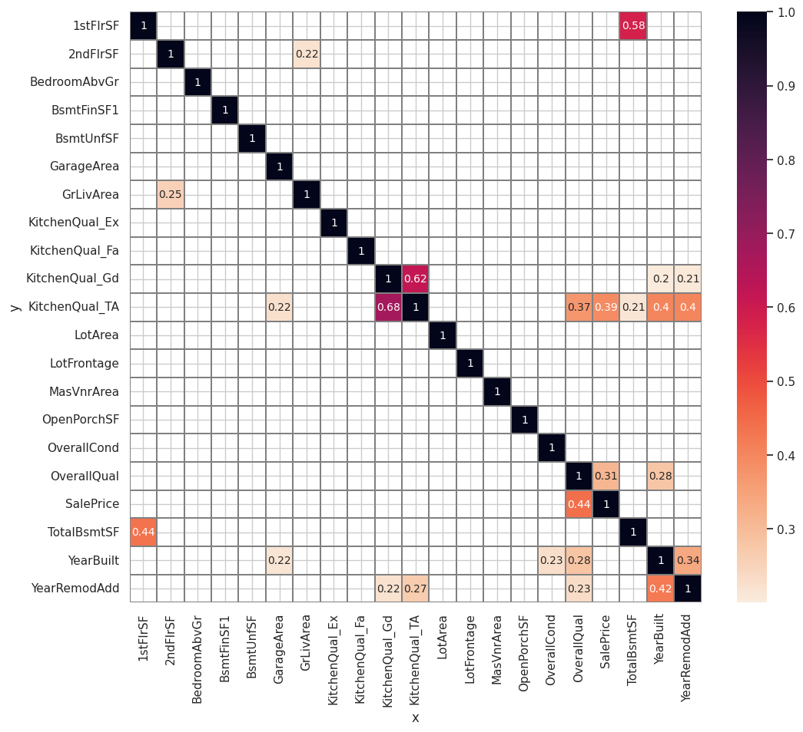

### Box Plots

These box plots illustrate how various features impact house prices.

*Box Plot of Price by Kitchen Quality shows price variation across kitchen quality levels.*
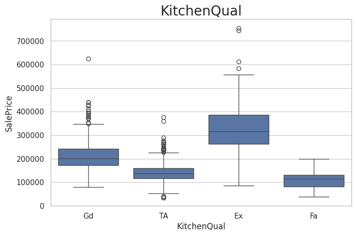

*Box Plot of Price by Overall Quality visualizes price differences by overall house quality.*
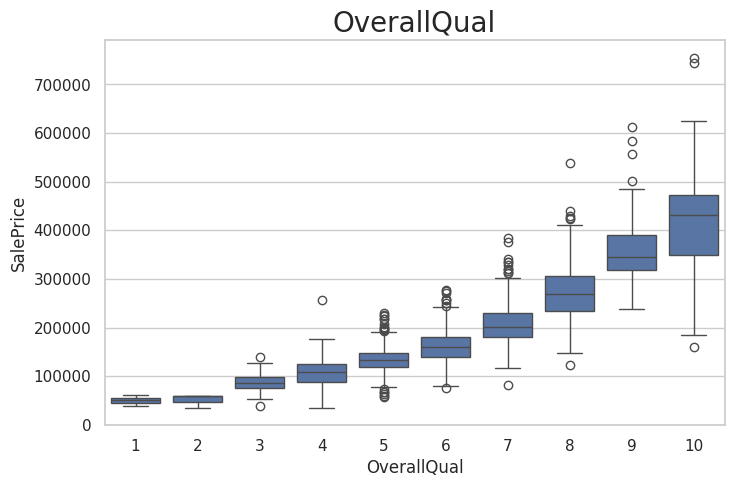

### Line Plots

These line plots depict trends in house prices over time and with building age.

*Line Plot of Price by Year Built reveals trends in house prices over the years.*
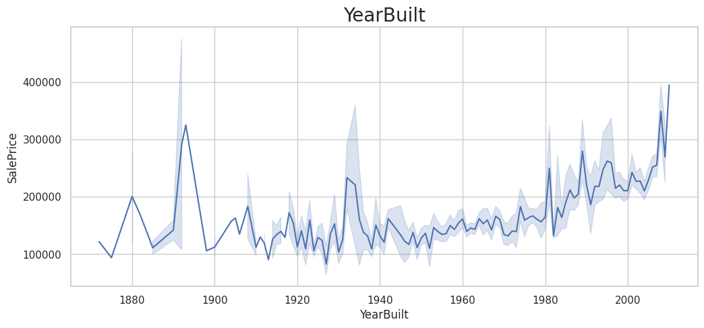

*Line Plot of Price by Year Remodeled shows how price changes with remodeling.*
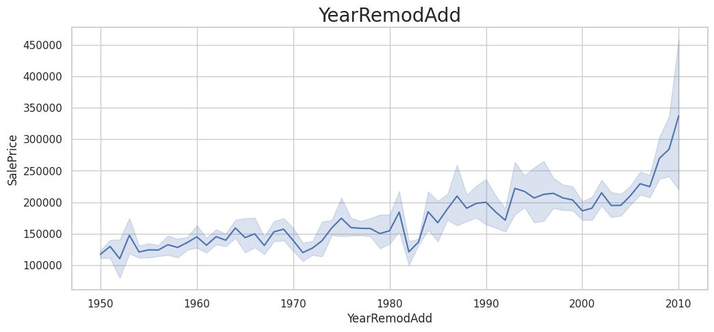

### Linear Model Plots

These plots show the relationships between house prices and specific features, based on linear regression.

*Linear Model of Price by 1st Floor Area demonstrates the impact of floor space on price.*
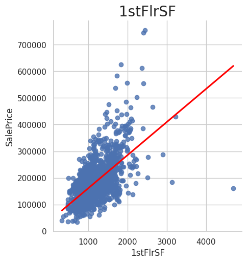

*Linear Model of Price by Garage Area illustrates the influence of garage size on house prices.*
- 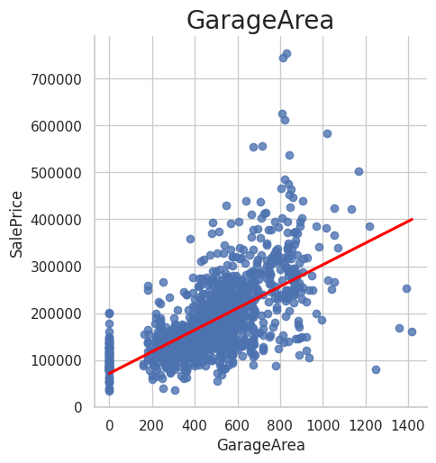

*Linear Model of Price by GrLiv Area visualizes the effect of the ground living area on prices.*
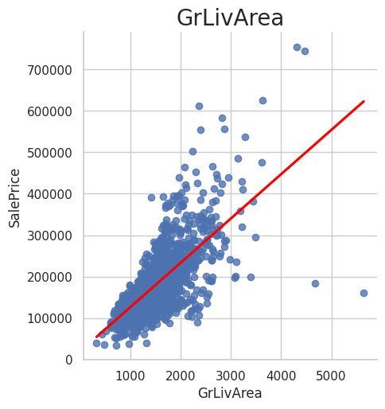

*Linear Model of Price by MasVnr Area shows the relationship between masonry veneer area and price.*
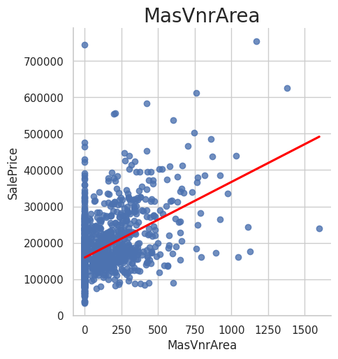

*Linear Model of Price by Open Porch Area illustrates how open porch space affects price.*
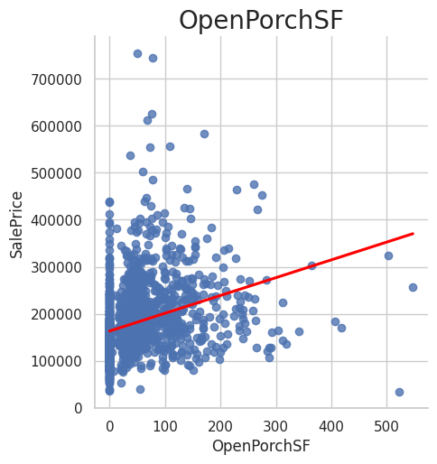

*Linear Model of Price by Total Basement Area highlights the impact of basement area on price.*
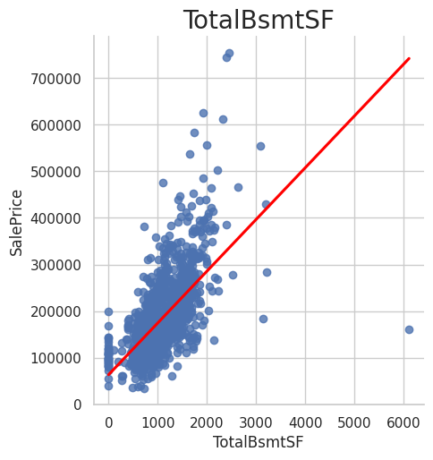

### Performance and Feature Importance

These plots help evaluate model performance and highlight the most important features.

*Feature Importance Plot identifies the most influential features for house price prediction.*
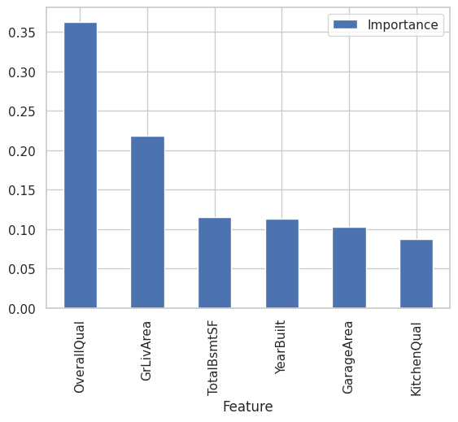

*Regression Performance Plot shows the effectiveness of the regression model.*
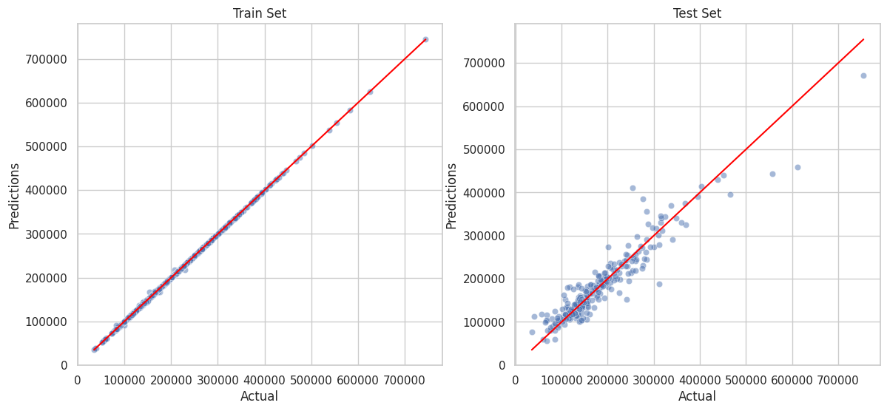

## Bugs and Fixes

- The `ppscore` library caused the following error:

ModuleNotFoundError: No module named 'pkg_resources'


This bug was fixed by adding `setuptools==75.8.0` to `requirements.txt`, as it is now necessary to have `setuptools` installed to use `ppscore` with current Python versions.

- During the hyperparameter optimization search, an extreme amount of FutureWarnings cluttered the output cell. It prevented the Jupyter Notebook from being managable:


I added this code to prevent the clutter:
```
import warnings
warnings.filterwarnings("ignore")
os.environ["PYTHONWARNINGS"] = "ignore"
```

## Project Testing

- Test checkboxes in the streamlit app

## Deployment

1. Log in to Render.com using Github.
2. Click on the New button, select Web Service.
3. At Source Code, select Git Providor. Select your repository name. Click Connect.
4. Enter a unique name for your web service.
5. Select the Python3 language.
6. Select the main branch.
7. Select the Frankfurt (EU Central) Region.
8. Set the Build Command: `pip install -r requirements.txt && ./setup.sh`
9. Set the Start Command: `streamlit run app.py`
10. Set Instance Type: Free
11. Set the Environment Variables: `Key: PORT` `Value: 8501` and `Key: PYTHON_VERSION` `Value: 3.12.1`
12. Click Deploy Web Service

## Technologies

- Github: The project's source code is hosted on GitHub at <https://github.com/>.
- GitHub Codespaces: The cloud-based integrated development environment (IDE) GitHub Codespaces at <https://github.com/> was used for code editing, running Visual Studio Code (Version 1.96.3).
- Render: The web application is deployed on Render at <https://render.com/>.
- CI Python Linter: Code formatting and adherence to PEP8 standards were ensured using the CI Python Linter at <https://pep8ci.herokuapp.com/>


## Python Packages

- Data Processing & Feature Engineering
  - feature-engine: A library for feature engineering in machine learning pipelines, offering transformations like encoding, imputation, and scaling.
  - pandas: A fundamental library for data manipulation and analysis using DataFrames and Series.
  - numpy: Provides support for numerical operations, arrays, and mathematical functions.

- Data Visualization
  - matplotlib: A widely used library for static, animated, and interactive visualizations.
  - seaborn: Built on top of Matplotlib, it simplifies statistical data visualization.
  - plotly: Enables interactive plots, dashboards, and web-based visualizations.

- Machine Learning & Model Evaluation
  - scikit-learn: A popular ML library offering tools for classification, regression, clustering, and preprocessing.
  - xgboost: An optimized gradient boosting framework widely used for structured data ML tasks.

- Data Profiling & Exploratory Analysis
  - ppscore: Calculates predictive power scores to determine relationships between variables.
  - ydata-profiling: Generates detailed EDA reports, summarizing data characteristics, correlations, and missing values.

- Web Applications & Image Processing
  - streamlit: A framework for building interactive ML and data science web apps with minimal code.

- Others
  - kaggle: A library for accessing and managing Kaggle datasets via the Kaggle API.
  - setuptools: A package development and distribution tool, ensuring dependencies are managed properly.

## Credits

### Code

A significantly large portion of the code used in this project was directly sourced from the Code Institute. This includes:

- Setup and Data Collection
  - Code to change working directory.
  - Code to create directories.
  - Code to download data from Kaggle.
  - Code to extract zip files.
  - Code to import CSV files.
- Exploratory Data Analysis (EDA) and Data Cleaning
  - Code to display DataFrame (df) summaries.
  - Code to count null values.
  - Code to count duplicates.
  - Code to drop variables from a DataFrame (df).
  - Code to subset columns or rows.
  - Code to generate an EDA report.
  - Code to visualize data cleaning effect.
  - Code to plot numerical and categorical variables.
  - Code to generate a heatmap.
  - Code to generate a histogram.
- Data Preprocessing
  - Code to apply mean imputation.
  - Code to apply median imputation.
  - Code to apply categorical imputation.
  - Code to OneHotEncode.
  - Code to apply ordinal encoding on categorical variables.
  - Code to apply a winsoriser transformation.
  - Code to apply a power transformation.
  - Code to apply a log transformation.
  - Code to apply feature scaling using standardization.
  - Code to check for feature engineering for numerical and categorical variables.
  - Code to identify highly correlated features.
  - Code to calculate correlation coefficients.
- Data Splitting and Feature Selection
  - Code to split train and test set.
  - Code to identify the most important features by the best regression model.
  - Code to extract the best regressor from search.
  - Code to extract the best hyperparameter.
  - Code to check the best model.
- Modeling and Hyperparameter Tuning
  - Code to perform hyperparameter optimization.
  - Code to summarizing the results of the grid searches.
  - Code to fit a machine learning pipeline.
- Model Evaluation and Saving
  - Code to evaluate regression performance on train set and test set.
  - Code to save a machine learning model to a pickle file.
- Dependancies
  - Code to load requirements.txt dependencies.
- Jupyter Notebooks
  - Code of a ipynb template file.
- Streamlit
  - Code to generate streamlit pages using an object-oriented approach.
- README
  - Template code in markdown.

The Code Institute code is available here:
- Lessons at <https://learn.codeinstitute.net/>
- Walkthrough projects at <https://github.com/Code-Institute-Solutions/WalkthroughProject01> and <https://github.com/Code-Institute-Solutions/churnometer>
- Template: <https://github.com/Code-Institute-Solutions/milestone-project-heritage-housing-issues>

The flow of the code in this project's Jupyter Notebooks, streamlit application, and README file was based on Werner Stäblein's repository available at <https://github.com/Werner-Staeblein/Project-5>

### Media

- The Unicode icons used in this project were generated with the assistance of ChatGPT, an AI language model developed by OpenAI. These icons were selected and formatted based on UX to enhance clarity and visual communication. ChatGPT is available at: <https://chatgpt.com/>

- The responsive-view image at the top of the README.md was created using: <https://ui.dev/amiresponsive>

### Content

- ChatGPT was frequently used to enhance text content and minimize errors in the Jupyter Notebooks, Streamlit Dashboard, and README.md file, but it was used responsibly due to its potential for mistakes caused by its own biases in training data, misinterpretation of context, and reasoning limitations.

## Acknowledgements

- I would like to acknowledge my mentor, Mo Shami, for his support throughout the project. His suggestion to explore the repositories of students doing the same project and run these repositories locally with the `streamlit run app.py` terminal command when the Render or Heroku deployments were unavailable was especially helpful.

- I also would like to acknowledge Code Institute tutors Niel McEwen and Roman Rakic, for showing me how to deploy to Render.com, through the guide available at: <https://code-institute-students.github.io/deployment-docs/42-pp5-pa/>

- Roman Rakic assisted me on another occasion where one of my plots became unresponsive. I had inadvertently assigned a continuous variable with too many unique values as the hue, causing the plot to hang and preventing the retrieval of any debugging information. Roman Rakic helped me identify the issue and resolve it, which better prepared me for working on this project.

- The entire Code Intitute Slack Community for its wealth of information, in particular the project-portfolio-5-predictive-analytics channel.